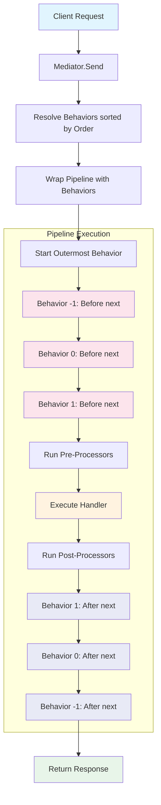

# DeepCode.SimpleMediator

A lightweight .NET 8+ Mediator pattern library for implementing in-process messaging with support for request/response, notifications, pipeline behaviors, and pre/post processors.

## Installation

```bash
dotnet add package DeepCode.SimpleMediator
```

## Features

- **Request/Response** - Send requests and receive responses from handlers
- **Notifications** - Publish notifications to multiple handlers
- **Pipeline Behaviors** - Wrap request handling with cross-cutting concerns
- **Pre/Post Processors** - Execute logic before/after handler execution
- **Order Control** - Control execution order with `Order` property
- **DI Integration** - Seamless integration with Microsoft.Extensions.DependencyInjection

## Execution Flow



### Pipeline Execution Order

Behaviors execution order is controlled by the `Order` property. Lower values execute first:

| Component | Order | Before `next()` | After `next()` |
|-----------|-------|-----------------|----------------|
| LoggingBehavior | -1 | ✓ (First) | ✓ (Last) |
| ValidationBehavior | 0 | ✓ | ✓ |
| TransactionBehavior | 1 | ✓ | ✓ |
| PreProcessor | 0 | ✓ | - |
| Handler | - | - | - |
| PostProcessor | 0 | - | ✓ |

## Quick Start

### 1. Define a Request

```csharp
public record GetUserQuery(int UserId) : IRequest<UserDto>;
```

### 2. Create a Handler

```csharp
public class GetUserQueryHandler : IRequestHandler<GetUserQuery, UserDto>
{
    private readonly IUserRepository _repository;

    public GetUserQueryHandler(IUserRepository repository)
    {
        _repository = repository;
    }

    public async Task<UserDto> Handle(GetUserQuery request, CancellationToken cancellationToken)
    {
        var user = await _repository.GetByIdAsync(request.UserId, cancellationToken);
        return new UserDto(user.Id, user.Name, user.Email);
    }
}
```

### 3. Register Services

```csharp
var services = new ServiceCollection();

// Register SimpleMediator and all handlers from the assembly
services.AddSimpleMediator(typeof(Program).Assembly);

// Or register from multiple assemblies
services.AddSimpleMediator(typeof(Program).Assembly, typeof(GetUserQueryHandler).Assembly);

var provider = services.BuildServiceProvider();
```

### 4. Use the Mediator

```csharp
var mediator = provider.GetRequiredService<IMediator>();

// Send a request
var user = await mediator.Send(new GetUserQuery(123));
```

## Notifications

### Define a Notification

```csharp
public record UserCreatedEvent(int UserId, string UserName) : INotification;
```

### Create Notification Handlers

```csharp
public class SendWelcomeEmailHandler : INotificationHandler<UserCreatedEvent>
{
    private readonly IEmailService _emailService;

    public SendWelcomeEmailHandler(IEmailService emailService)
    {
        _emailService = emailService;
    }

    public async Task Handle(UserCreatedEvent notification, CancellationToken cancellationToken)
    {
        await _emailService.SendWelcomeEmailAsync(notification.UserId, cancellationToken);
    }
}

public class LogUserCreationHandler : INotificationHandler<UserCreatedEvent>
{
    private readonly ILogger<LogUserCreationHandler> _logger;

    public LogUserCreationHandler(ILogger<LogUserCreationHandler> logger)
    {
        _logger = logger;
    }

    public Task Handle(UserCreatedEvent notification, CancellationToken cancellationToken)
    {
        _logger.LogInformation("User created: {UserId} - {UserName}", 
            notification.UserId, notification.UserName);
        return Task.CompletedTask;
    }
}
```

### Publish Notifications

```csharp
await mediator.Publish(new UserCreatedEvent(123, "John Doe"));
```

## Pipeline Behaviors

Pipeline behaviors wrap request handling, enabling cross-cutting concerns like logging, validation, caching, and transactions.

### Define a Behavior

```csharp
public class LoggingBehavior<TRequest, TResponse> : IPipelineBehavior<TRequest, TResponse>
    where TRequest : IRequest<TResponse>
{
    private readonly ILogger<LoggingBehavior<TRequest, TResponse>> _logger;

    public LoggingBehavior(ILogger<LoggingBehavior<TRequest, TResponse>> logger)
    {
        _logger = logger;
    }

    public int Order => -1; // Execute first (lower = earlier)

    public async Task<TResponse> Handle(
        TRequest request, 
        RequestHandlerDelegate<TResponse> next, 
        CancellationToken cancellationToken)
    {
        var requestName = typeof(TRequest).Name;
        _logger.LogInformation("Handling {RequestName}", requestName);

        var response = await next(cancellationToken);

        _logger.LogInformation("Handled {RequestName}", requestName);

        return response;
    }
}
```

### Register Behaviors

```csharp
services.AddTransient(typeof(IPipelineBehavior<,>), typeof(LoggingBehavior<,>));
services.AddTransient(typeof(IPipelineBehavior<,>), typeof(ValidationBehavior<,>));
```

### Execution Order

Use the `Order` property to control execution order. Lower values execute first:

```csharp
public class ValidationBehavior<TRequest, TResponse> : IPipelineBehavior<TRequest, TResponse>
    where TRequest : IRequest<TResponse>
{
    public int Order => 0; // Execute after LoggingBehavior (-1)

    public async Task<TResponse> Handle(
        TRequest request, 
        RequestHandlerDelegate<TResponse> next, 
        CancellationToken cancellationToken)
    {
        // Validation logic here
        return await next(cancellationToken);
    }
}
```

## Pre/Post Processors

### Pre-Processor

Executes before the handler:

```csharp
public class ValidationPreProcessor<TRequest> : IPreProcessor<TRequest>
{
    public int Order => 0;

    public Task Process(TRequest request, CancellationToken cancellationToken)
    {
        // Validate request before handler executes
        if (request is IValidatable validatable)
        {
            validatable.Validate();
        }
        return Task.CompletedTask;
    }
}
```

### Post-Processor

Executes after the handler:

```csharp
public class CachePostProcessor<TRequest, TResponse> : IPostProcessor<TRequest, TResponse>
{
    private readonly ICacheService _cache;

    public CachePostProcessor(ICacheService cache)
    {
        _cache = cache;
    }

    public int Order => 0;

    public async Task Process(TRequest request, TResponse response, CancellationToken cancellationToken)
    {
        if (request is ICacheableRequest cacheable)
        {
            await _cache.SetAsync(cacheable.CacheKey, response, cancellationToken);
        }
    }
}
```

### Register Processors

```csharp
services.AddTransient(typeof(IPreProcessor<>), typeof(ValidationPreProcessor<>));
services.AddTransient(typeof(IPostProcessor<,>), typeof(CachePostProcessor<,>));
```

## Complete Example

```csharp
using Microsoft.Extensions.DependencyInjection;
using DeepCode.SimpleMediator;
using DeepCode.SimpleMediator.Abstractions;
using DeepCode.SimpleMediator.DependencyInjection;
using DeepCode.SimpleMediator.Pipeline;

// Request and handler
public record CreateUserCommand(string Name, string Email) : IRequest<int>;

public class CreateUserCommandHandler : IRequestHandler<CreateUserCommand, int>
{
    private readonly IUserRepository _repository;

    public CreateUserCommandHandler(IUserRepository repository)
    {
        _repository = repository;
    }

    public async Task<int> Handle(CreateUserCommand request, CancellationToken cancellationToken)
    {
        var user = new User { Name = request.Name, Email = request.Email };
        await _repository.AddAsync(user, cancellationToken);
        return user.Id;
    }
}

// Validation behavior
public class ValidationBehavior<TRequest, TResponse> : IPipelineBehavior<TRequest, TResponse>
    where TRequest : IRequest<TResponse>
{
    public int Order => 0;

    public async Task<TResponse> Handle(
        TRequest request, 
        RequestHandlerDelegate<TResponse> next, 
        CancellationToken cancellationToken)
    {
        if (request is IValidatable validatable)
        {
            validatable.Validate();
        }
        return await next(cancellationToken);
    }
}

// Logging behavior
public class LoggingBehavior<TRequest, TResponse> : IPipelineBehavior<TRequest, TResponse>
    where TRequest : IRequest<TResponse>
{
    private readonly ILogger<LoggingBehavior<TRequest, TResponse>> _logger;

    public LoggingBehavior(ILogger<LoggingBehavior<TRequest, TResponse>> logger)
    {
        _logger = logger;
    }

    public int Order => -1; // Execute before validation

    public async Task<TResponse> Handle(
        TRequest request, 
        RequestHandlerDelegate<TResponse> next, 
        CancellationToken cancellationToken)
    {
        _logger.LogInformation("Handling {Request}", typeof(TRequest).Name);
        var response = await next(cancellationToken);
        _logger.LogInformation("Handled {Request}", typeof(TRequest).Name);
        return response;
    }
}

// Registration
var services = new ServiceCollection();
services.AddSimpleMediator(typeof(Program).Assembly);
services.AddLogging();
var provider = services.BuildServiceProvider();

// Usage
var mediator = provider.GetRequiredService<IMediator>();
var userId = await mediator.Send(new CreateUserCommand("John", "john@example.com"));
```

## License

MIT
